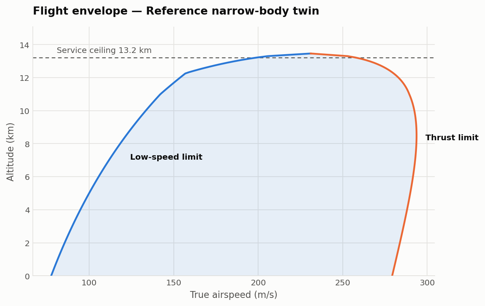

# Aircraft flight performance calculator

Classical flight-performance metrics computed from first principles — ISA
atmosphere, a parabolic drag polar, thrust lapse with altitude and Mach — and
checked against published data for three real aircraft.

The point of the project is not that it produces numbers. It is that the
numbers are **falsifiable**: every routine either has a closed-form answer it is
tested against, or a physical identity it must satisfy, and where the model
disagrees with reality the disagreement is measured and explained rather than
tuned away.



## What it computes

| | |
|---|---|
| **Atmosphere** | ISO 2533 to 20 km — troposphere and isothermal stratosphere |
| **Aerodynamics** | Lift and drag coefficients, L/D, stall speed |
| **Speeds** | Minimum-drag speed, best-range speed, min and max level speed |
| **Climb** | Rate of climb, absolute and service ceilings |
| **Mission** | Breguet range, endurance, payload-range diagram |
| **Figures** | Thrust curves, flight envelope, payload-range |

## Quick start

```bash
pip install -r requirements.txt
python3 -m pytest          # 52 tests
```

```python
from src.aircraft import NARROWBODY_TWIN as ac
from src import performance as perf

perf.v_min_drag(ac, 10000)         # minimum drag speed at 10 km, m/s
perf.service_ceiling(ac)           # m
perf.max_rate_of_climb(ac, 0)      # (m/s, m/s) — best rate and the speed for it

from src.plotting import generate_all
generate_all(ac)                   # writes the three figures
```

## Validation

Full results and caveats in **[VALIDATION.md](VALIDATION.md)**, generated by the
same code that computes them so the write-up cannot drift from the model.

Three aircraft across a 4.5× mass range — 737-800, A320-200, 777-300ER.
Manufacturers do not publish CD0 or Oswald efficiency, so every result carries a
band swept across the plausible range of both; a published figure inside that
band is the honest form of agreement.

| Quantity | Verdict |
|---|---|
| Service ceiling | Within 8% on all three. Two published figures fall outside the drag-polar band — the 777 gap is weight (the model returns the published 13.1 km at 92% MTOW), the A320 gap is not, and is most likely a certified operating altitude rather than a performance ceiling |
| Range | Right order, wrong definition — the model burns all fuel in cruise while published range carries reserves. Use the implied-payload column, not the percentage |
| **Maximum speed** | **Not usable above M 0.8** — see below |
| (L/D)max | 17–18 across all three, the right band for a jet transport |

## Known limitations

**No compressibility drag.** The parabolic polar has no wave-drag term, so drag
never rises at the divergence Mach number and the solver happily finds a
transonic thrust–drag intersection. The model predicts a maximum speed of Mach
0.98–1.09 for aircraft that cruise at 0.78–0.84. **Any maximum-speed result
above about Mach 0.8 is meaningless**, and the flight envelope's right-hand
boundary inherits the same caution. Adding a wave-drag rise above M_dd is the
clearest next improvement.

**Cruise is flown at constant altitude and speed.** Real aircraft step-climb as
fuel burns to hold CL near its optimum. For the 777-300ER, L/D decays from 18.0
to 16.9 over the cruise against a maximum of 18.1 — a step climb holds it near
the peak, and that difference is most of the range shortfall at maximum payload.

**Jet formulations only.** Propeller aircraft need power-based equivalents.

**Reference data needs primary sources.** The published figures are from the
open literature and carried in code, not transcribed from airport planning
documents or type certificate data sheets. Verify before citing.

## Three bugs worth recording

Every one of these produced perfectly self-consistent numbers. None would have
been caught by comparing against stored output — they were only wrong against
the physical world, and two became visible only once plotted.

1. **A factor of g.** TSFC is stored mass-based in kg/(N·s), the standard form,
   but Breguet expressed in weights needs 1/s. The missing conversion put the
   range at 67 000 km.
2. **Thrust that ignored forward speed.** A turbofan kept full static thrust at
   cruise Mach, giving a 16.8 km ceiling and a 12° climb angle. Fixed with
   Mattingly's high-bypass lapse.
3. **A stall-limited envelope.** The envelope's left edge was stall speed at
   every altitude. Above roughly 12 km a jet runs out of thrust before it runs
   out of wing, so the true low-speed boundary is thrust-limited — the chart was
   claiming level flight where the aircraft cannot hold height.

## Layout

```
src/atmosphere.py    ISA model
src/aircraft.py      geometry, drag polar, engine
src/performance.py   drag, climb, ceilings, range, endurance
src/plotting.py      figures on a colour-vision-validated palette
src/validation.py    published-data comparison, generates VALIDATION.md
tests/               52 tests
```
